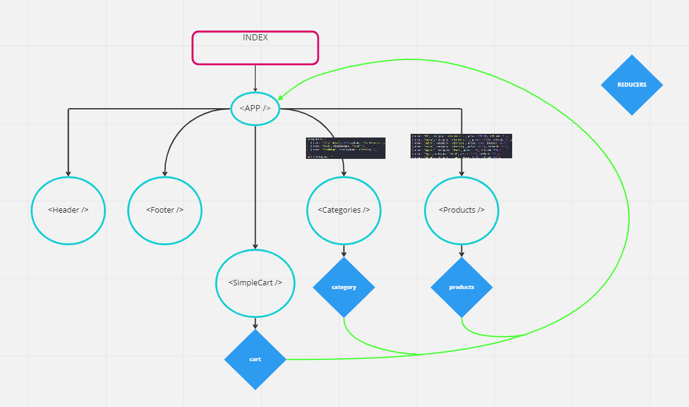
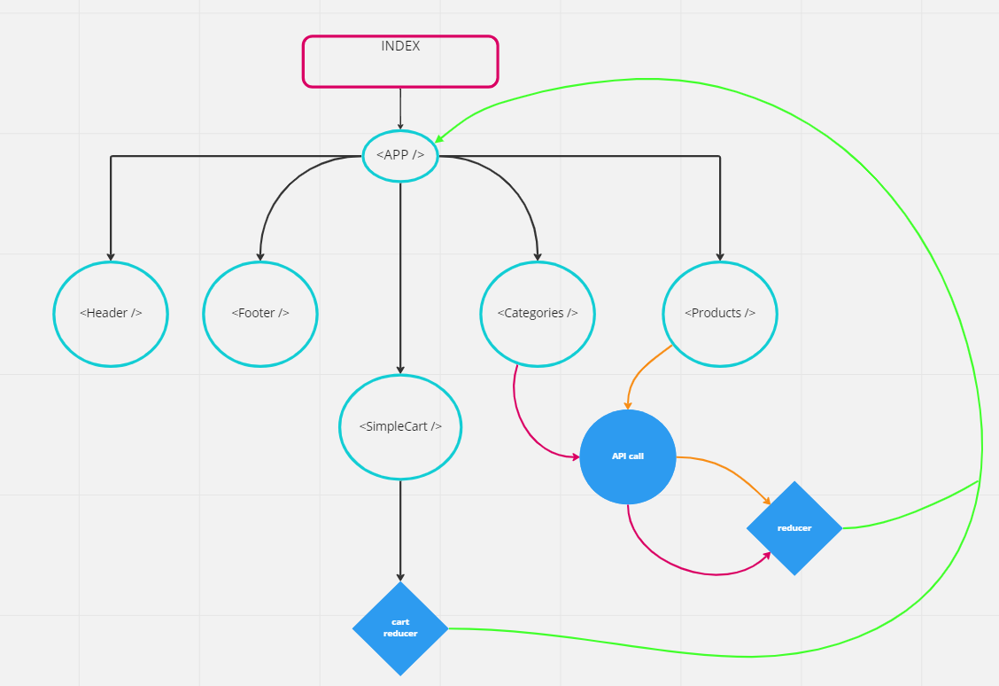

# REACT app using Redux: StoreFront

## Author : Tim Traylor

## Problem Domain

### Lab36 - Phase 1 (Application State with Redux)

Start a REACT project that will be a 'StoreFront' application. Set up initial structure and state management for listing products in categories. Display product information when clicked on and shows relevant data.

### Lab37 - Phase 2 (Combined Reducers)

Allows user to "Add to Cart" and have them in the 'shopping cart' for later purchase. User is able to see items in shopping cart and remove them individually.

### Lab38 - Phase 3 (Asynchronous Actions)

Connect 'StoreFront' to live API so data is persistent and separately managed. Allows user to interact with inventory via API. Allows user to what items in card and able to remove from cart which will update API.

#### Common Requirements

    - Style with Material UI Components
    - Testing of individual functions and end-to-end

## Setup

- packages required to install using `npm install`
- app can be run locally with `npm start`

Updates from:
    - `https://api-js401.herokuapp.com/api/v1/todo`
    - `https://api-js401.herokuapp.com/api/v1/products`
    - `https://api-js401.herokuapp.com/api/v1/categories`

## Tests

- `npm test` will run test suite with Jest

## UML and Diagrams

